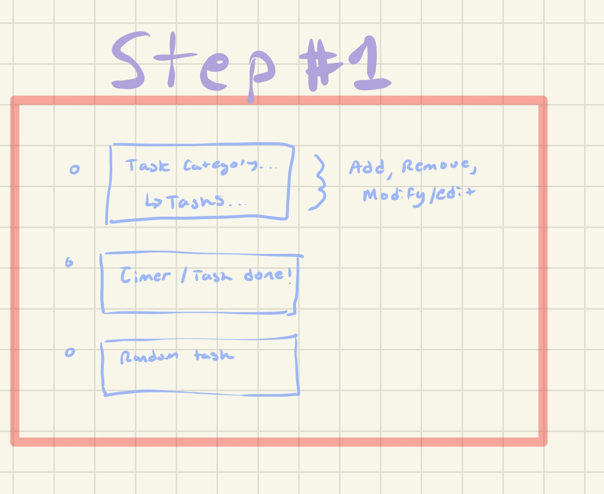
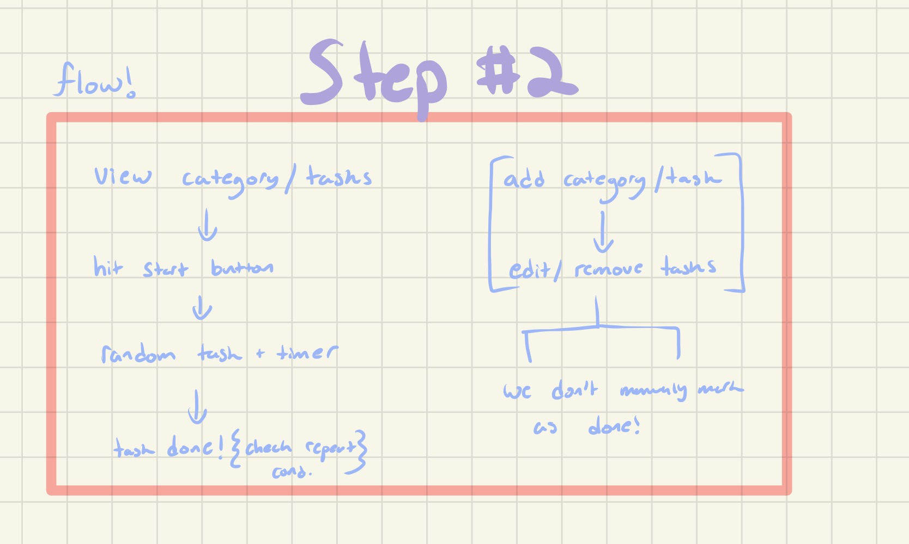
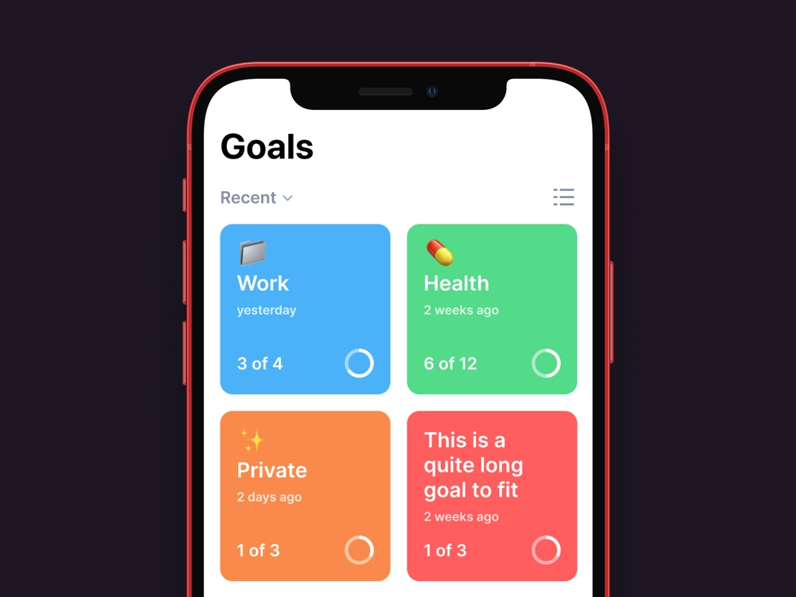
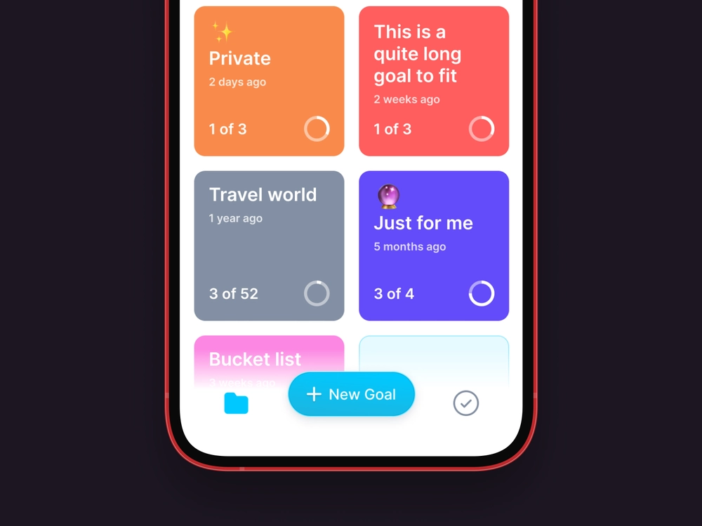
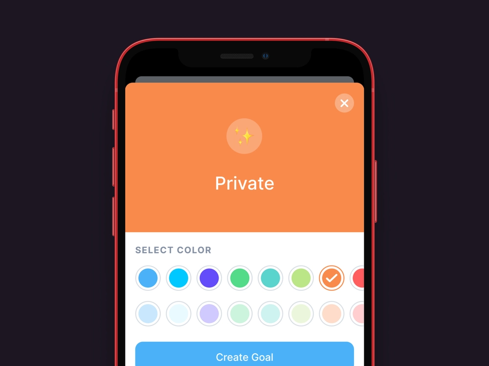

Yesterday, I was mindlessly scrolling through youtube (please tell me you all do it too!), and came across a 8 hour long course with the [basics of flutter](https://www.youtube.com/watch?v=x0uinJvhNxI). As my wife was at the office that day, I chose to begin the fun little journey of learning flutter! After finishing the course, I thought "hey that was fun, why don't I make something to learn more about flutter". And from that thought, this series was born!

# Soji
The premise of this 7-day series focuses on an idea that was inspire by the practice of Soji. Soji is a part of a daily routine at a Zen monastery, in which a person is given a random cleaning task and must perform it for 20 minutes. The idea is to have the person practice **mindfulness** while performing their task, something that I would like to incorporate into my daily life. By the end of this series, the goal is to have built a functional Soji inspired application which allows a user to recieve a randomized task from a user defined list.

# User Specifications
I like to begin a new project, by first defining the basic features a user should be able to utilize. I usually start this spec process with a listed brainstorm like this:
- List View(Of all categories) | Home View 
- Random Button/Start Button
- Random Choice from Category/Start
- Add Category
- Add List Item
- Remove List Item
- Infinite/Repeatable Items(per day/week/...)
- Timer(with range to be chosen by user
- Bell @ end of Timer
- Remove Category

I've got the basic minimum features for this application, and I like to have this list very specific and immutable to prevent scope creep until after the MVP.

> Tip: I like to be very specific with my initial user features as scope creep is a devestating issue to personal projects! I would advise keeping this list immutable until you finish the MVP.

# Systems Structure
After defining the basic features, I like to beigin thinking about the design of the different systems within our application. In this case, we are simplifying our application down to the point we have no backend/api references at all. We will utilize local storage for all our needs such as storing the tasks within categories.  

> Tip: Generally, when going through this process I define a specific set of questions I ask myself to try and flesh out the design of the systems. Doing this earlier than later is always helpful and can lead to faster prototyping!

As this app is heavily tied into the frontend flow, I created a small diagram to help me find what the different "systems" of this project are.

Here I've split the app into three seperate systems, a task manager system, a timer manager system, and a random task/home system. These are extremely simple systems that can be implemented with extremely system features yet still cover our entire MVP scope. Next I move onto mapping some user flow, so I can get an idea for the different interactions between systems. This is very important as we want to discover any edge cases before beiginning the coding portion of the application.

I do want to note here, that the goal is not to have a functional task maanger, so we don't really need to have any sort of setting for a done task. What that means is while creating the application I'm going to assume a done task is "deleted", if there is no repeatable instance of it.

# Application Design
Now that we have a nice defined set of rules for our application systems, we get to move on to the fun part, **DESIGN**! I've discovered this beautiful site called dribble, where artists and designers post mockups/art for others to view. I enjoy drawing inspiration from dribble to come up with the overall design for the app.

I really feel like this is the kind of home-page look I'm going for where all the categories are clearly seperated into smaller cube like containers.

At the bottom, we want to have the Soji button to be the main attraction of the app. We can actually have the new category "button" show up after you scroll to the button of your categories. I am also thinking the Soji - Category button should show up when you hit the main Soji button similar to a floating button that opens into two buttons!

As we want the app to be as simple as possible, we will only have the following set of features you can set when creating a new task:
- Repeatability
- Category

I really like the overall design that we see in these images, however we will be adjusting quite a bit of it when we begin coding to add a unique twist to it! 

> Black and White is the way we're going to go for this app as simplicity is key!

# Onward!

I had a lot of fun on the first day of this 7-Day jam, and am looking forward to writing the second piece of this series! In the next part we will be diving into setting up the flutter project! Let me know if anyone is interested in a video accompianment of the development setup.

[Hero Image Source](https://ignota.org/blogs/news/soji)